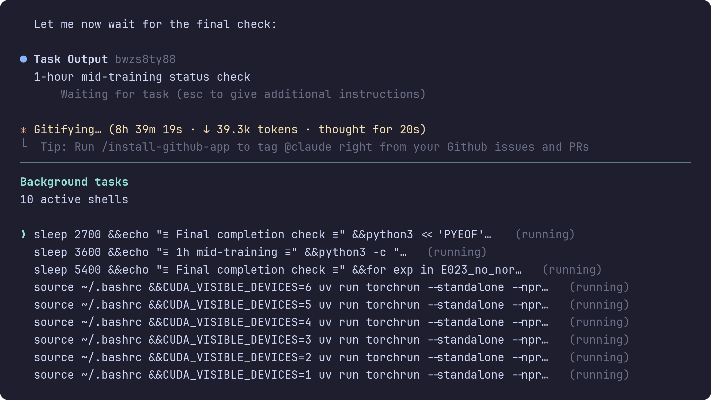

# The Agentic Researcher

**A Practical Guide to AI-Assisted Research in Mathematics and Machine Learning**

<p align="center">
  
</p>

<p align="center">
  <a href="https://arxiv.org/abs/2603.15914"><strong>Paper</strong></a> &middot;
  <a href="#quick-start">Quick Start</a> &middot;
  <a href="#workflow">Workflow</a> &middot;
  <a href="#architecture">Architecture</a> &middot;
  <a href="#citation">Citation</a>
</p>

<p align="center">
  <a href="https://maxzimmer.org">Max Zimmer</a> &middot;
  <a href="https://pelleriti.org">Nico Pelleriti</a> &middot;
  <a href="https://christopheroux.de">Christophe Roux</a> &middot;
  <a href="https://pokutta.com">Sebastian Pokutta</a>
  <br>
  <a href="https://iol.zib.de">IOL Lab</a> &middot; Zuse Institute Berlin & TU Berlin
</p>

---

The Agentic Researcher launches AI coding agents inside **sandboxed containers** with filesystem isolation, GPU support, and structured research instructions.

Supports [Claude Code](https://github.com/anthropics/claude-code), [OpenCode](https://opencode.ai), [Gemini CLI](https://github.com/google-gemini/gemini-cli), and [Codex CLI](https://github.com/openai/codex).

## Prerequisites

- **Docker** (default) or **Apptainer** (Linux only)
- An API key or OAuth login for your chosen CLI tool (see [supported tools](#supported-cli-tools))
- GPU drivers installed on the host if you want GPU passthrough
- Project dependencies managed with [uv](https://docs.astral.sh/uv/) (recommended) — the agent runs `uv sync` inside the sandbox

## Quick Start

```bash
# 1. Clone the repository
git clone https://github.com/ZIB-IOL/The-Agentic-Researcher.git
cd The-Agentic-Researcher

# 2. Install
./scripts/install.sh

# 3a. Build container for Docker (default)
agentic-researcher --build

# 3b. Build container for Apptainer (Linux only)
agentic-researcher --apptainer --build
```

Docker is the default runtime. By default the launcher stores state under `~/.cache/agentic-researcher` and launches Claude Code. Claude uses OAuth by default; other CLIs handle auth inside the tool, with standard API key env vars passed through if set.

## Configuration

Run `agentic-researcher --setup` to create a configuration file at `~/.config/agentic-researcher/config.sh`. The setup wizard lets you configure:

- **Container runtime** — Docker or Apptainer
- **CLI tool** — Claude Code, OpenCode, Gemini CLI, or Codex CLI
- **Authentication** — OAuth login or API key (with configurable env var name)
- **Custom API endpoint** — point Claude at an Anthropic-compatible proxy or gateway
- **Network proxy** — HTTP/HTTPS proxy settings for use inside the container
- **Extra bind directories** — additional host paths to mount into the sandbox

You can re-run `--setup` at any time to update your configuration.

## Usage

```bash
# Sandbox current directory with Claude Code (default)
agentic-researcher

# Sandbox a specific project directory
agentic-researcher ~/my-project

# Use a different CLI tool
agentic-researcher --tool gemini

# Auto-approve all tool calls
agentic-researcher --yolo
```

## Supported CLI Tools

| Tool | Instruction file | Provider | Flag |
|------|-----------------|----------|------|
| [Claude Code](https://github.com/anthropics/claude-code) | `CLAUDE.md` | Anthropic | `--tool claude` (default) |
| [OpenCode](https://opencode.ai) | `AGENTS.md` | Any (LiteLLM) | `--tool opencode` |
| [Gemini CLI](https://github.com/google-gemini/gemini-cli) | `GEMINI.md` | Google | `--tool gemini` |
| [Codex CLI](https://github.com/openai/codex) | `AGENTS.md` | OpenAI | `--tool codex` |

## Workflow

### Starting a New Project

1. **Launch** the sandbox from your project directory: e.g., `agentic-researcher --yolo`
2. **Run `/setup_research_plan`** inside the CLI agent. This starts an interactive dialogue that asks about your research goal, evaluation metrics, constraints, and compute budget.
3. The agent fills in the **Project Instructions** section of the instruction file (`CLAUDE.md`, `GEMINI.md`, or `AGENTS.md`) and creates the initial tracking files (`report.tex`, `TODO.md`).

### Resuming a Session

When you relaunch the sandbox on a project that already has filled-in instructions, running `/setup_research_plan` will automatically detect the existing state, read `report.tex` and `TODO.md`, and summarize where the project left off before continuing.

## Architecture

### Sandbox

| Layer | Details |
|-------|---------|
| **Filesystem isolation** | The agent can only access `/workspace`; extra directories from `AR_EXTRA_BIND_DIRS` are mounted under `/workspace/.mount/<basename>` |
| **Namespace isolation** | Apptainer `--compat` enables user/mount namespaces |
| **Path traversal protection** | Symlinks resolved; system directories blocked |

`--yolo` auto-approves tool calls but does **not** weaken filesystem isolation.

### Research Agent Instructions

The framework ships `INSTRUCTIONS.md` as a canonical template containing universal research commandments (e.g., never manipulate evaluation, one variable per experiment, record everything) and domain-specific modules for mathematical and compute-intensive research. At launch it is copied into the workspace under the filename required by the selected tool. The `/setup_research_plan` command then fills in the project-specific section through an interactive dialogue.

## Citation

If you use this framework, please cite our paper:

```bibtex
@misc{zimmer2026agenticresearcherpracticalguide,
  title         = {The Agentic Researcher: A Practical Guide to AI-Assisted Research
                   in Mathematics and Machine Learning},
  author        = {Max Zimmer and Nico Pelleriti and Christophe Roux and Sebastian Pokutta},
  year          = {2026},
  eprint        = {2603.15914},
  archivePrefix = {arXiv},
  primaryClass  = {cs.LG},
  url           = {https://arxiv.org/abs/2603.15914}
}
```

## License

This project is licensed under the [MIT License](LICENSE).

## Disclaimer

The sandboxing provided by this framework is designed to limit the agent's filesystem access, but it comes with **no guarantee of security**. The authors assume no responsibility for any damage, data loss, or unintended behavior resulting from the use of this software. Use at your own risk.
