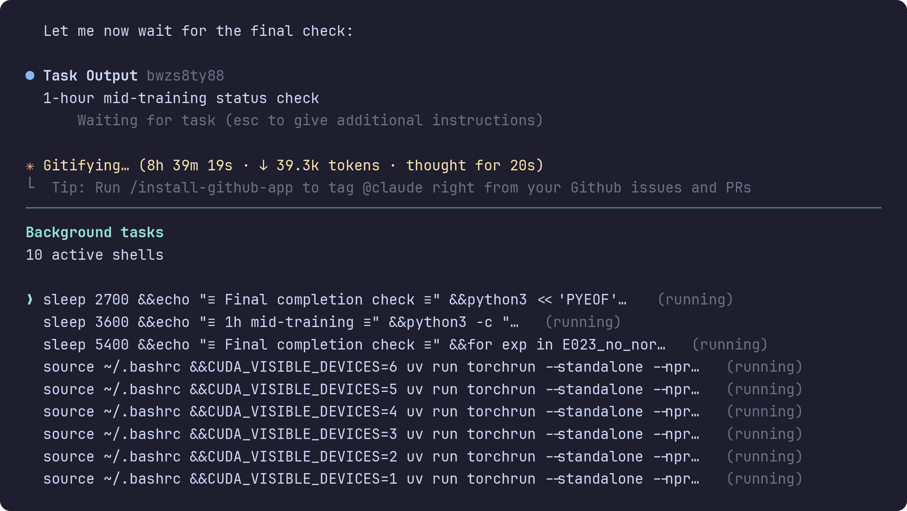

# The Agentic Researcher

**A Practical Guide to AI-Assisted Research in Mathematics and Machine Learning**

<p align="center">
  
</p>

<p align="center">
  <a href="https://arxiv.org/abs/2603.15914"><strong>Paper</strong></a> &middot;
  <a href="https://maxzimmer.org/the-agentic-researcher/"><strong>Project Page</strong></a> &middot;
  <a href="#quick-start">Quick Start</a> &middot;
  <a href="#workflow">Workflow</a> &middot;
  <a href="#architecture">Architecture</a> &middot;
  <a href="#citation">Citation</a>
</p>

<p align="center">
  <a href="https://maxzimmer.org">Max Zimmer</a> &middot;
  <a href="https://pelleriti.org">Nico Pelleriti</a> &middot;
  <a href="https://christopheroux.de">Christophe Roux</a> &middot;
  <a href="https://pokutta.com">Sebastian Pokutta</a>
  <br>
  <a href="https://iol.zib.de">IOL Lab</a> &middot; Zuse Institute Berlin & TU Berlin
</p>

---

The Agentic Researcher launches AI coding agents inside **sandboxed containers** with filesystem isolation, GPU support, and structured research instructions.

Supports [Claude Code](https://github.com/anthropics/claude-code), [OpenCode](https://opencode.ai), [Gemini CLI](https://github.com/google-gemini/gemini-cli), [Codex CLI](https://github.com/openai/codex), [Qwen Code](https://github.com/QwenLM/qwen-code), and [pi](https://github.com/badlogic/pi-mono).

**No image builds.** Containers start from a stock base image (`node:24-bookworm`, or a CUDA image when GPUs are active). All CLI tools, runtimes, and utilities are installed at runtime into a **persistent store** on the host (`AR_STATE_ROOT`, mounted at `/ar-store`) and reused across sessions. The container is throwaway; the store is the system of record.

## Prerequisites

- **Docker** (default) or **Podman** (Apptainer support is planned — see `TODO.md`)
- An API key or OAuth login for your chosen CLI tool (see [supported tools](#supported-cli-tools))
- GPU drivers installed on the host if you want GPU passthrough
- Project dependencies managed with [uv](https://docs.astral.sh/uv/) (recommended) — the agent runs `uv sync` inside the sandbox

## Quick Start

```bash
# 1. Clone the repository
git clone https://github.com/ZIB-IOL/The-Agentic-Researcher.git
cd The-Agentic-Researcher

# 2. Install
./scripts/install.sh

# 3. (Optional) Prewarm the tool store - otherwise the first launch installs everything
agentic-researcher --build

# 4. Launch from your project directory
agentic-researcher
```

Docker is the default runtime when available; if only Podman is installed, the launcher falls back to it automatically (rootless Podman is supported via `--userns keep-id`). By default the launcher keeps the store under `~/.cache/agentic-researcher` and launches Claude Code. Claude uses OAuth by default (login state persists in the store); other CLIs handle auth inside the tool, with the standard key env vars (`ANTHROPIC_API_KEY`, `OPENAI_API_KEY`, `GOOGLE_API_KEY`, `GEMINI_API_KEY`) passed through from your host environment if set.

On first launch the entrypoint installs Claude Code, Gemini CLI, OpenCode, Codex, Qwen Code, pi, plus `bun`, `uv`, `julia`, `jq`, `yq`, `gh`, `git-lfs`, `ripgrep`, `rsync`, `tmux`, `micro`, and `chktex` into the store (a few minutes). Subsequent launches reuse the store and only check for updates (cached, 6h TTL; disable with `AR_UPDATE=never`).

## Configuration

Run `agentic-researcher --setup` to create a configuration file at `${XDG_CONFIG_HOME:-$HOME/.config}/agentic-researcher/config.sh`. The setup wizard lets you configure:

- **Container runtime** — Docker or Podman
- **CLI tool** — Claude Code, OpenCode, Gemini CLI, Codex CLI, Qwen Code, or pi
- **Authentication** — OAuth login or API key (with configurable env var name)
- **Custom endpoints** — `AR_CUSTOM_ANTHROPIC_ENDPOINT` points Claude at an Anthropic-compatible gateway; `AR_CUSTOM_ENDPOINT` configures a generic OpenAI-compatible endpoint for OpenCode/pi/Codex (OpenCode and pi get a config rendered from `config/*.template.json` — copy a template into the config directory to customize the model list; the API key travels via env var, never written to disk)
- **Persistent store** (`AR_STATE_ROOT`) — where all tools, runtimes, caches, and the agent home live. Defaults to `~/.cache/agentic-researcher`; point it at scratch storage on hosts with small or slow home directories
- **Network proxy** — HTTP/HTTPS proxy settings for use inside the container

Additional settings (see `config/config.example.sh`): `AR_IMAGE` / `AR_GPU_IMAGE` (base images), `AR_DOCKER_GPUS` (auto|all|none), `AR_UPDATE` / `AR_UPDATE_TTL` (tool update policy), `AR_NO_COOLDOWN` (supply-chain cooldown exemptions), `AR_EXTRA_ENV` (pipe-separated `KEY=VALUE` pairs forwarded into the container, e.g. `HF_TOKEN=hf_...|WANDB_API_KEY=...`), `AR_UNSAFE`, `AR_LOCKDOWN`, `AR_EPHEMERAL`.

Environment variables with the same names override config file values per invocation. You can re-run `--setup` at any time to update your configuration.

## Usage

```bash
# Sandbox current directory with Claude Code (default)
agentic-researcher

# Sandbox a specific project directory
agentic-researcher ~/my-project

# Use a different CLI tool
agentic-researcher --tool gemini
agentic-researcher --tool pi

# Auto-approve all tool calls
agentic-researcher --yolo

# Plain shell inside the sandbox (all tools on PATH)
agentic-researcher --tool bash

# Shell into an already-running session
agentic-researcher --shell

# Validate the sandbox environment
agentic-researcher --test

# Show the resolved configuration (secrets redacted)
agentic-researcher --print-env

# Throwaway store: everything installed fresh, removed when the session ends
agentic-researcher --ephemeral --tool bash
```

> **Note:** Multi-node Slurm dispatch from v1 (Apptainer-based) is temporarily
> unavailable in v2 and will return together with Apptainer support — see `TODO.md`.

## Supported CLI Tools

| Tool | Instruction file | Provider | Flag |
|------|-----------------|----------|------|
| [Claude Code](https://github.com/anthropics/claude-code) | `CLAUDE.md` | Anthropic | `--tool claude` (default) |
| [OpenCode](https://opencode.ai) | `AGENTS.md` | Any | `--tool opencode` |
| [Gemini CLI](https://github.com/google-gemini/gemini-cli) | `GEMINI.md` | Google | `--tool gemini` |
| [Codex CLI](https://github.com/openai/codex) | `AGENTS.md` | OpenAI | `--tool codex` |
| [Qwen Code](https://github.com/QwenLM/qwen-code) | `QWEN.md` | Alibaba | `--tool qwen` |
| [pi](https://github.com/badlogic/pi-mono) | `AGENTS.md` | Any | `--tool pi` |

## Workflow

### Starting a New Project

1. **Launch** the sandbox from your project directory: e.g., `agentic-researcher --yolo`
2. **Run `/setup_research_plan`** inside the CLI agent. This starts an interactive dialogue that asks about your research goal, evaluation metrics, constraints, and compute budget.
3. The agent fills in the **Project Instructions** section of the instruction file (`CLAUDE.md`, `GEMINI.md`, or `AGENTS.md`) and creates the initial tracking files (`report.tex`, `TODO.md`).

### Resuming a Session

When you relaunch the sandbox on a project that already has filled-in instructions, running `/setup_research_plan` will automatically detect the existing state, read `report.tex` and `TODO.md`, and summarize where the project left off before continuing.

## Architecture

### Persistent store, ephemeral container

There is no Dockerfile and no image registry. Every run starts from a stock
upstream image; the entrypoint (`container/inner.sh`) inspects the persistent
store mounted at `/ar-store` and converges it toward the expected toolset:
anything installed and current is reused, anything missing or outdated is
installed. Adding a tool means appending it to the entrypoint's install list —
no rebuilds, no version skew. The agent's home directory (`/ar-store/home`)
lives in the store, so tool state and OAuth logins persist across sessions.

### Sandbox

| Layer | Details |
|-------|---------|
| **Filesystem isolation** | The agent can only access `/workspace` (your project) and `/ar-store` (the tool store). No SSH keys, no host home, no other projects |
| **Capability hardening** | `--cap-drop=ALL` with a minimal add-back set; `--security-opt no-new-privileges`; optional `AR_LOCKDOWN=1` (read-only rootfs, tmpfs `/tmp`, pids limit) |
| **Privilege drop** | Setup runs as root, then the CLI is exec'd as the host user via `setpriv` (Docker on Linux); rootless Podman maps the user via `--userns keep-id` |
| **Supply-chain cooldown** | npm/bun/uv enforce a 7-day minimum release age, and npm blocks post-install scripts; exempt fast-moving tools via `AR_NO_COOLDOWN` |
| **Path traversal protection** | Symlinks resolved; system directories blocked |

`--yolo` auto-approves tool calls but does **not** weaken filesystem isolation.

### GPU support

With `AR_DOCKER_GPUS=auto` (default), GPUs are passed through (`--gpus all`)
when `nvidia-smi` is present on a Linux host with Docker, and the base image
switches to `AR_GPU_IMAGE` (CUDA + cuDNN). ML caches (`HF_HOME`,
`TRITON_CACHE_DIR`, `WANDB_DIR`) point into the store so checkpoints and
datasets never bloat the project tree.

### Research Agent Instructions

The framework ships `INSTRUCTIONS.md` as a canonical template containing universal research commandments (e.g., never manipulate evaluation, one variable per experiment, record everything) and domain-specific modules for mathematical and compute-intensive research. At launch it is copied into the workspace under the filename required by the selected tool. The `/setup_research_plan` command then fills in the project-specific section through an interactive dialogue.

## Citation

If you use this framework, please cite our paper:

```bibtex
@misc{zimmer2026agenticresearcherpracticalguide,
  title         = {The Agentic Researcher: A Practical Guide to AI-Assisted Research
                   in Mathematics and Machine Learning},
  author        = {Max Zimmer and Nico Pelleriti and Christophe Roux and Sebastian Pokutta},
  year          = {2026},
  eprint        = {2603.15914},
  archivePrefix = {arXiv},
  primaryClass  = {cs.LG},
  url           = {https://arxiv.org/abs/2603.15914}
}
```

## License

This project is licensed under the [MIT License](LICENSE).

## Disclaimer

The sandboxing provided by this framework is designed to limit the agent's filesystem access, but it comes with **no guarantee of security**. The authors assume no responsibility for any damage, data loss, or unintended behavior resulting from the use of this software. Use at your own risk.
